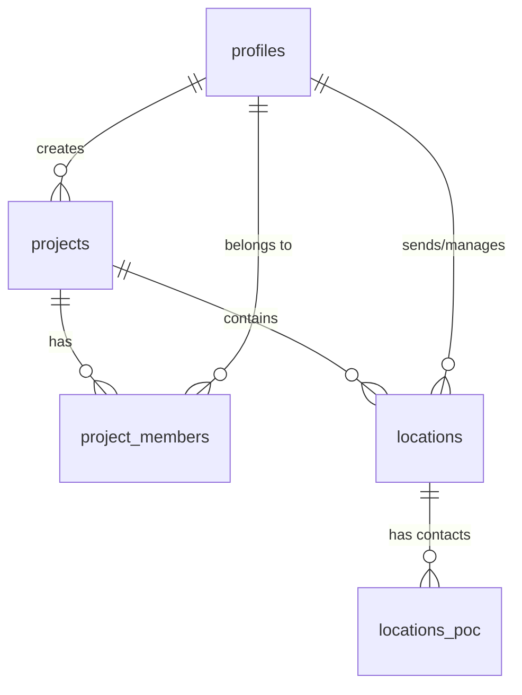

# 2026-03-06 Morning Patch Summary

본 문서는 2026년 3월 6일 오전 세션 동안 진행된 데이터베이스 스키마 확장, API 구현 및 UI 개발 내용을 정리한 패치 노트입니다. 팀 협업 및 메인 브랜치 병합 시 참고 자료로 활용하시기 바랍니다.

---

## 1. Database Schema & Columns

### 1) `profiles` (유저 프로필 정보)
Supabase Auth 유저와 연동되는 사용자 정보 테이블입니다.
- `id` (UUID): `auth.users`의 ID를 참조하는 고유 식별자.
- `email` (TEXT): 사용자 이메일 (Unique).
- `nickname` (TEXT): 앱 내에서 사용할 별명.
- `avatar_url` (TEXT): 프로필 이미지 경로.
- `created_at` / `updated_at` (TIMESTAMP): 계정 생성 및 수정 시점.

### 2) `projects` (프로젝트 기본 정보)
프로젝트의 생명주기와 기본 메타데이터를 관리합니다.
- `id` (UUID): 프로젝트 고유 식별자.
- `title` (TEXT): 프로젝트 이름.
- `created_by` (UUID): 프로젝트 생성자 (profiles 테이블 참조).
- `status` (TEXT): 프로젝트 상태 (`ongoing`, `completed`, `hold`).
- `start_date` / `end_date` (DATE): 프로젝트 기간.
- `total_days` (INTEGER): 총 진행 일수.
- `note` (TEXT): 프로젝트 관련 비고 및 요약.

### 3) `project_members` (프로젝트 멤버 및 권한)
사용자와 프로젝트 간의 다대다(N:M) 관계를 정의하며 권한을 관리합니다.
- `project_id` (UUID): 연결된 프로젝트.
- `user_id` (UUID): 참여 유저.
- `role` (TEXT): 멤버 역할 (`owner`, `admin`, `member`).
- `joined_at` (TIMESTAMP): 참여 시점.

### 4) `locations` (장소 섭외 및 관리)
프로젝트 내의 장소 섭외지/카드 정보를 관리합니다. (기존 `recruitments`에서 명칭 변경)
- `id` (UUID): 장소 고유 식별자.
- `project_id` (UUID): 소속 프로젝트.
- `title` (TEXT): 장소/섭외지 이름.
- `location_date` (DATE): 방문/섭외 날짜.
- `status` (TEXT): 장소 진행 상태 (`requested`, `confirmed`, `hold`).
- `card_status` (TEXT): 카드 세부 상태 (`pending`, `coordinator_pending`, `crew_pending`).
- `shooting_time` (TEXT): 촬영 예정 시간.
- `cost` (DECIMAL): 예상/확정 비용.
- `deposit_status` (BOOLEAN): 선금 지급 여부.
- `deposit_amount` (DECIMAL): 선금 금액.
- `content` / `note` (TEXT): 상세 요청 내용 및 비고.

### 5) `locations_poc` (장소 담당자 정보)
한 장소에 연결된 여러 명의 연락처(Point of Contact)를 관리합니다.
- `id` (UUID): POC 고유 식별자.
- `location_id` (UUID): 연결된 장소 (`locations.id` 참조).
- `name` (TEXT): 담당자 이름.
- `phone` / `email` (TEXT): 담당자 연락처 정보.

---

## 2. Table Relationships

1.  **Project : Member (1:N)**: 프로젝트 하나에 여러 멤버가 참여하며, 각 멤버는 `role`을 가집니다.
2.  **Project : Location (1:N)**: 프로젝트 내에서 여러 군데의 장소 섭외를 진행합니다.
3.  **Location : POC (1:N)**: 하나의 장소(예: 박물관)에 여러 담당자(예: 홍보팀, 시설관리팀)를 등록할 수 있습니다.

---

## 3. Work Summary (오전 세션 작업 내용)

### 1) 데이터베이스 및 RLS 보안 강화
- **RLS 무한 루프 수정**: `check_is_project_member` 보안 함수를 도입하여 멤버 조회 시 발생하는 재귀 에러를 해결했습니다.
- **멤버 추가 권한 설정**: 프로젝트 소유자(`owner`)와 관리자(`admin`)만 새로운 멤버를 초대할 수 있도록 정책을 보완했습니다.
- **유저 검색 정책**: 프로젝트 멤버 초대를 위해 다른 유저의 프로필(이메일, 닉네임)을 검색할 수 있는 정책을 추가했습니다.

### 2) 기능 개발 (API & Hooks)
- **멤버 초대 시스템**: 이메일/닉네임으로 유저를 검색하고, 프로젝트 생성 시 다수의 멤버를 한 번에 초대하는 로직을 구현했습니다.
- **장소 관리 시스템**: 장소 섭외 정보와 다중 담당자 정보를 CRUD할 수 있는 API(`src/api/locations.js`) 및 Hook(`src/hooks/useLocations.js`)을 구축했습니다.

### 3) UI/UX 개선
- **`TempProjectSelectorScreen`**: 프로젝트 생성 시 기간, 비고, 멤버 검색 및 추가가 가능한 확장된 폼을 구현했습니다.
- **`LocationScreen` & `LocationForm`**: 하단 "섭외관리" 탭을 장소 관리 시스템으로 전면 교체했습니다. 카드 형태의 목록 보기와 복잡한 담당자 정보 입력이 가능한 모달 폼을 추가했습니다.

---

**Note**: 모든 SQL 스키마는 `locations_schema.sql`을 통해 최신화되었으며, Supabase 적용 시 기존 `recruitments` 테이블은 자동으로 정리됩니다.
